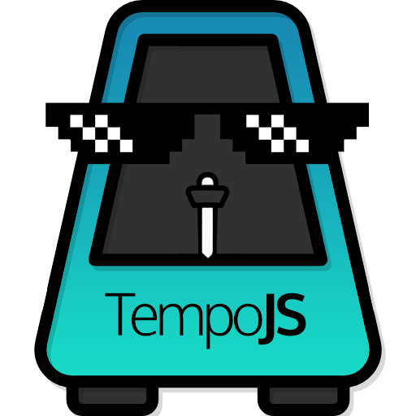

# TempoJS · 

 
TempoJS is a JavaScript game engine for turn-based games.

## Getting Started

In The Future. :)

## Documentation

In The Future. :)

## Contributing

In The Future. :)

### Code of Conduct

Our Code of Conduct is adapted from the Contributor Covenant with some aditions. Make sure to [read it](https://github.com/Katreque/TempoJS/blob/master/CODE_OF_CONDUCT.md) in order to be part of our Community.

### Contributing Guide

Read our [contributing guide](https://github.com/Katreque/TempoJS/blob/master/CONTRIBUTING.md) to learn about our development process, how to propose bugfixes and improvements, and how to build and test your changes to TempoJS.

## License

TempoJS is [BSD 3-Clause Licensed](https://github.com/Katreque/TempoJS/blob/master/LICENSE).
